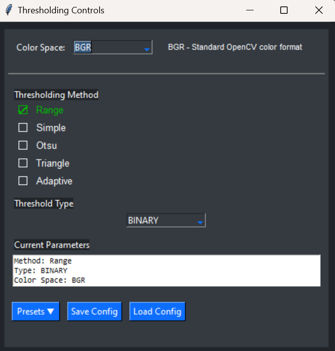

<div align="center" id="paramtunercv">

# ParamTunerCV

[](https://python.org)
[](https://opencv.org)
[](https://opensource.org/licenses/MIT)
[](https://github.com/harsh194/ParamTunerCV/graphs/commit-activity)

*Professional interactive image viewer and processing application for computer vision research and real-time parameter tuning.*

</div>

---

## 📋 Table of Contents

- [Quick Start](#quick-start)
- [Features](#features)
- [Examples](#examples)
- [Controls](#controls)
- [Interface Gallery](#interface-gallery)
- [Architecture](#architecture)
- [API Reference](#api-reference)
- [Contributing](#contributing)
- [License](#license)

<a id="quick-start"></a>
## 🚀 Quick Start

```bash
  # Option 1: Install from PyPI (recommended for users)
  pip install ParamTunerCV

  # Option 2: Install with uv (fastest)
  uv add ParamTunerCV

  # Option 3: Development setup with uv (recommended for contributors)
  git clone https://github.com/harsh194/ParamTunerCV.git
  cd ParamTunerCV
  uv sync

  # Option 4: Development setup with pip
  git clone https://github.com/harsh194/ParamTunerCV.git
  cd ParamTunerCV
  pip install -e .

  # Test the installation
  python examples/01_basic_usage.py
```

**Requirements:** Python 3.8+, OpenCV 4.10.0, NumPy 2.2.6, Matplotlib 3.10.3

<a id="features"></a>
## ✨ Features

- **50+ Pre-configured Trackbars** - Real-time parameter tuning for morphology, edge detection, filtering, thresholding
- **15+ Specialized Factory Viewers** - Ready-to-use viewers for Canny, Hough transforms, corner detection
- **Interactive ROI System** - Rectangle, polygon, and line drawing with visual feedback
- **Multi-Space Thresholding** - Support for 7 color spaces (BGR, HSV, Lab, etc.) with binary, adaptive, Otsu methods
- **Professional Analysis Suite** - Multi-channel histograms, pixel intensity profiles, JSON/CSV export
- **Dual Operation Modes** - Full GUI for development, headless for production automation

<a id="examples"></a>
## 📖 Examples

Start with these progressive examples in the `examples/` folder:

| Example | Description |
|---------|-------------|
| `01_basic_usage.py` | Core workflow and main loop pattern |
| `02_window_control.py` | Window management and UI controls |
| `03_trackbar_definitions.py` | Custom trackbars and parameter control |
| `04_app_debug_mode.py` | GUI vs headless operation modes |
| `05_viewer_factory_usage.py` | Pre-built viewers for common CV tasks |

### Quick Integration

```python
from ParamTunerCV import ImageViewer, ViewerConfig
import numpy as np
import cv2

config = ViewerConfig()

trackbar_definitions = [
    {"name": "Show Image", "param_name": "show", "max_value": "num_images-1", "initial_value": 0},
    {"name": "Count", "param_name": "count", "max_value": 50, "initial_value": 10}, 
    {"name": "Gauss Size", "param_name": "GaussianSize", "max_value": 31, "callback": "odd", "initial_value": 5}, 
    {"name": "Thresh Val", "param_name": "thresh_val", "max_value": 255, "initial_value": 128}, 
]

IMG_HEIGHT, IMG_WIDTH = 600, 800
viewer = ImageViewer(config, trackbar_definitions)

while viewer.should_loop_continue():
    params = viewer.trackbar.parameters
    
    current_thresh = params.get("thresh_val") 
    current_gaussian_size = params.get("GaussianSize", 5)
    block_count = params.get("count", 10)

    base_color_image = np.full((IMG_HEIGHT, IMG_WIDTH, 3), (block_count * 5, 0, 0), dtype=np.uint8)
    cv2.rectangle(base_color_image, (50, 50), (IMG_WIDTH - 50, IMG_HEIGHT - 50), (0, 255, 0), 3)

    gray_image = cv2.cvtColor(base_color_image, cv2.COLOR_BGR2GRAY)

    gauss_image = cv2.GaussianBlur(gray_image, (current_gaussian_size, current_gaussian_size), 0)

    _, thresh_image = cv2.threshold(gauss_image, current_thresh, 255, cv2.THRESH_BINARY)
    
    viewer.display_images = [
        (base_color_image, "Color"),
        (gray_image, "Grayscale Image"),
        (gauss_image, "Gaussian Blur)"),
        (thresh_image, "Threshold image")
    ]

viewer.cleanup_viewer()
```
<a id="controls"></a>
## 🖱️ Controls

**Mouse:** Left drag (ROI), wheel (zoom), middle drag (pan), right click (remove selection)

**Keys:** R (rectangle), L (line), P (polygon), H (histogram), Q/ESC (quit)

<a id="interface-gallery"></a>
## 📸 Interface Gallery

### 🎛️ Real-Time Parameter Control
<div align="center">

</div>

*50+ preconfigured trackbars for real-time OpenCV parameter tuning - adjust Gaussian blur, edge detection, morphological operations, and thresholding with immediate visual feedback*

### 📊 Professional Analysis Suite
<div align="center">

</div>

*Comprehensive analysis control panel with ROI management, drawing tools, histogram generation, pixel intensity profiling, and integrated data export functionality*

### 🎨 Advanced Multi-Space Thresholding
<div align="center">

</div>

*Sophisticated thresholding interface supporting 7 color spaces (BGR, HSV, Lab, etc.) with binary, adaptive, Otsu, and range-based methods for precise image segmentation*

### 💾 Multi-Format Data Export
<div align="center">

</div>

*Professional export system for analysis results - save histograms, pixel profiles, and geometric data in JSON/CSV formats with configurable options*

<!-- ### 📝 Interactive Text Display
<div align="center">

</div>

*Clean text interface for displaying analysis results, parameter values, and system information with theme-aware styling* -->

<a id="architecture"></a>
## 🏗️ Architecture

```
src/
├── core/           # ImageViewer main orchestrator
├── config/         # ViewerConfig management  
├── controls/       # TrackbarManager for real-time controls
├── events/         # MouseHandler for interactions
├── gui/            # WindowManager and UI components
├── analysis/       # Analysis modules (plotting, export, threshold)
└── utils/          # Factory methods and utilities
```

**Design:** Factory pattern for viewers, Observer pattern for callbacks, Fluent interface for configuration

<a id="api-reference"></a>
## 📚 API Reference
### Testing

```bash
python examples/01_basic_usage.py  # Primary test
```

<a id="contributing"></a>
## 🤝 Contributing

1. Fork the repository
2. Create feature branch: `git checkout -b feature/amazing-feature`
3. Test changes: `python examples/01_basic_usage.py`
4. Submit pull request

**Coding Standards:** PEP 8, docstrings, type hints

<a id="license"></a>
## 📄 License

MIT License © 2025 Harsh Ranjan  
**Contact:** harshranjan194@gmail.com

---

<div align="center">

[⬆️ Back to Top](#paramtunercv)

</div>