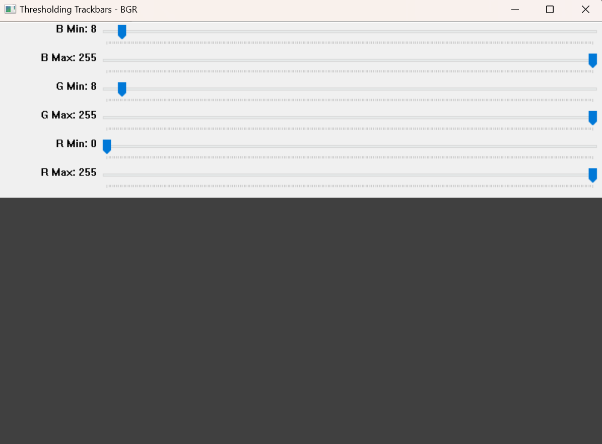

# ParamTunerCV

A professional-grade interactive image viewer and processing application for computer vision research, image analysis, and real-time parameter tuning. Built with OpenCV and Python.

## 🚀 Quick Start

```bash
git clone https://github.com/your-username/paramtunercv.git
cd paramtunercv
pip install -r requirements.txt
python examples/01_basic_usage.py
```

## ✨ Key Features

- **50+ Pre-configured Trackbars**: Complete trackbar definitions for morphology, edge detection, filtering, thresholding, feature detection, and color space operations
- **15+ Specialized Factory Viewers**: Ready-to-use viewers for Canny edge detection, morphological operations, Hough transforms, corner detection, and more
- **Professional Multi-Window GUI**: Integrated OpenCV + matplotlib + tkinter interface with proper resource management and thread safety
- **Sophisticated ROI System**: Interactive rectangle, polygon, and line drawing with visual feedback, animations, and multi-region analysis
- **Comprehensive Analysis Suite**: Multi-channel histograms, pixel intensity profiles, and multi-format data export (JSON/CSV)
- **Advanced Thresholding Engine**: Support for 7 color spaces (BGR, HSV, HLS, Lab, Luv, YCrCb, XYZ) with binary, adaptive, and range-based methods
- **Dual Operation Modes**: Full-featured GUI for interactive development and headless mode for production automation

## 📖 Examples & Usage

Complete examples are provided in the `examples/` folder. Start with these:

### Essential Examples
1. **`01_basic_usage.py`** - Core workflow and main loop pattern
2. **`02_window_control.py`** - UI window management options
3. **`03_trackbar_definitions.py`** - Parameter control and trackbar setup
4. **`04_app_debug_mode.py`** - Development vs production modes
5. **`05_viewer_factory_usage.py`** - Pre-configured viewers for CV tasks

```bash
# Run examples from the project root
python examples/01_basic_usage.py
python examples/02_window_control.py
# ... etc
```

See `examples/README.md` for detailed explanations of each example.

## 🖱️ Mouse Controls

- **Left Click & Drag**: Rectangle ROI selection
- **Mouse Wheel**: Zoom in/out
- **Middle Click & Drag**: Pan image
- **Right Click**: Remove last selection
- **Double Right Click**: Clear all selections

### Keyboard Shortcuts

- **R**: Rectangle mode (default)
- **L**: Line mode (pixel profiles)
- **P**: Polygon mode
- **H**: Show histogram
- **Shift+P**: Show pixel profiles
- **Q/ESC**: Quit

## 📸 Interface Gallery

### Real-Time Parameter Control

*50+ preconfigured trackbars for real-time OpenCV parameter tuning - adjust Gaussian blur, edge detection, morphological operations, and thresholding with immediate visual feedback*

### Professional Analysis Suite  

*Comprehensive analysis control panel with ROI management, drawing tools, histogram generation, pixel intensity profiling, and integrated data export functionality*

### Advanced Multi-Space Thresholding

*Sophisticated thresholding interface supporting 7 color spaces (BGR, HSV, Lab, etc.) with binary, adaptive, Otsu, and range-based methods for precise image segmentation*

### Multi-Format Data Export

*Professional export system for analysis results - save histograms, pixel profiles, and geometric data in JSON/CSV formats with configurable options*

### Interactive Text Display

*Clean text interface for displaying analysis results, parameter values, and system information with theme-aware styling*

## 🏗️ Architecture

```
src/
├── core/           # ImageViewer main class
├── config/         # ViewerConfig management
├── controls/       # TrackbarManager
├── events/         # MouseHandler
├── gui/            # UI components
├── analysis/       # Analysis tools
└── utils/          # Factory functions
```

## 🧪 Testing

```bash
# Run examples to test functionality
python examples/01_basic_usage.py
python examples/05_viewer_factory_usage.py

# Legacy test script (deprecated)
python check.py
```

## 🐛 Troubleshooting

**OpenCV Window Issues**: Reduce window size or disable features
**Large Images**: Use `resize_if_large()` helper function
**Plot Issues**: Try different matplotlib backends (`matplotlib.use('TkAgg')`)

## 📄 License

MIT License - see LICENSE file for details.

## 🤝 Contributing

1. Fork the repository
2. Create feature branch
3. Make changes
4. Test with `python examples/01_basic_usage.py`
5. Submit pull request

---

**ParamTunerCV** - Professional image analysis made simple.